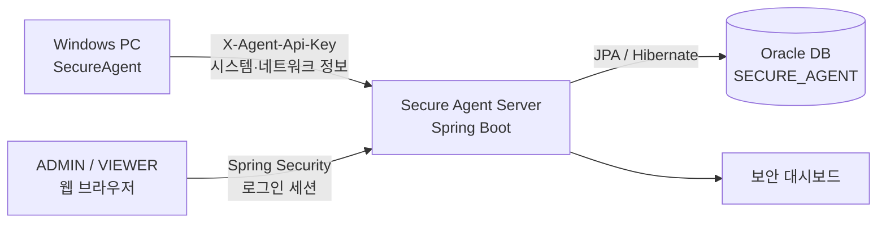

# Secure Agent Server

Windows PC에서 수집한 시스템·네트워크 보안 정보를 중앙에서 저장하고 조회하는 Spring Boot 기반 관리 서버입니다.

별도의 `SecureAgent`가 PC의 시스템 정보, 열린 포트, 네트워크 연결, 패킷 메타데이터를 수집해 전송하면 서버가 API 인증 후 Oracle DB에 저장하고 웹 대시보드로 시각화합니다.


## 프로젝트 목적

- 여러 Windows PC의 보안 현황을 한 화면에서 확인
- 열린 포트와 외부 네트워크 연결의 위험도 분석
- 원시 패킷 대신 필요한 메타데이터만 저장하여 민감정보 수집 최소화
- 사람의 웹 접근과 Agent 프로그램의 API 접근을 서로 다른 방식으로 인증
- 운영에 필요한 계정 관리, 감사 로그, 원격 진단 기능 제공

## 주요 기능

| 구분 | 기능 |
| --- | --- |
| 시스템 정보 | 컴퓨터 이름, 운영체제, 버전, 사용자 정보 저장 및 조회 |
| 열린 포트 | 포트, 프로토콜, PID, 프로세스명, 상태 저장 및 위험도 분석 |
| 네트워크 연결 | 로컬·원격 주소와 포트, 연결 상태, 프로세스 정보 및 의심 연결 분석 |
| 패킷 메타데이터 | 프로토콜, 방향, 통신량, 외부 통신 여부, DNS·HTTP Host·TLS SNI 저장 |
| 대시보드 | PC별 현황, 통계, 위험 항목, 차트 및 상세 목록 조회 |
| 사용자 관리 | `ADMIN`과 `VIEWER` 권한 분리, 비밀번호 변경·초기화, 계정 잠금 해제 |
| 감사 로그 | 로그인 성공·실패, 로그아웃, 비밀번호 변경 등 주요 보안 이벤트 기록 |
| 원격 진단 | 허용된 호스트를 대상으로 OpenSSH 기반 진단 명령 실행 |
| 배포 운영 | 실행 가능한 JAR 빌드, PowerShell 기반 백그라운드 시작·종료 및 로그 저장 |

## 전체 구조



### 데이터 처리 흐름

1. Agent가 Windows PC의 보안 정보를 수집합니다.
2. Agent가 요청 헤더에 `X-Agent-Api-Key`를 담아 서버 API로 전송합니다.
3. 서버의 `AgentApiKeyFilter`가 API Key를 검증합니다.
4. Controller → Service → Repository 계층을 거쳐 Oracle DB에 저장합니다.
5. 로그인한 사용자가 권한에 따라 대시보드에서 결과를 조회합니다.

## 보안 설계

### 웹 사용자 인증

- Spring Security 폼 로그인과 세션 인증
- BCrypt 기반 비밀번호 해시 저장
- `ADMIN`과 `VIEWER` 역할 기반 접근 제어
- 로그인 5회 실패 시 계정 잠금
- 일반 웹 요청에 CSRF 보호 적용
- 로그인·로그아웃·비밀번호 변경 등 보안 이벤트 감사 기록

### Agent API 인증

- Agent의 `POST /api/agents/**` 요청에만 API Key 필터 적용
- `X-Agent-Api-Key` 헤더로 Agent를 인증
- API Key가 서버에 설정되지 않으면 Agent 전송 API를 기본 차단
- 웹 로그인 세션과 Agent API 인증을 분리하여 접근 경로별 책임 구분

### 비밀정보 관리

- DB 비밀번호, 초기 계정 비밀번호, API Key, SSH 경로는 환경변수로 주입
- 실제 환경변수 파일인 `deploy/secure-server.env.ps1`은 `.gitignore`로 제외
- JAR, 실행 로그, PID 파일, SSH 개인키와 `known_hosts`도 Git 저장 대상에서 제외

## 기술 스택

| 영역 | 기술 |
| --- | --- |
| Backend | Java 17, Spring Boot 4.1.1, Spring MVC |
| Security | Spring Security, BCrypt, Session, CSRF, API Key Filter |
| Persistence | Spring Data JPA, Hibernate |
| Database | Oracle Database, Oracle JDBC Driver |
| Frontend | HTML5, CSS3, Vanilla JavaScript |
| Build | Maven Wrapper, Spring Boot Maven Plugin |
| Deployment | Executable JAR, PowerShell |
| Remote diagnostics | Windows OpenSSH |

## 주요 API

| Method | URL | 설명 | 인증 |
| --- | --- | --- | --- |
| `POST` | `/api/agents/system-info` | 시스템 정보 저장 또는 수정 | Agent API Key |
| `POST` | `/api/agents/{computerName}/open-ports` | 열린 포트 목록 저장 | Agent API Key |
| `POST` | `/api/agents/{computerName}/network-connections` | 네트워크 연결 목록 저장 | Agent API Key |
| `POST` | `/api/agents/{computerName}/packet-metadata` | 패킷 메타데이터 저장 | Agent API Key |
| `GET` | `/api/agents/**` | Agent 수집 정보 조회 | `ADMIN`, `VIEWER` |
| `PUT/PATCH/DELETE` | `/api/agents/**` | Agent 데이터 수정·삭제 | `ADMIN` |
| `POST` | `/api/admin/remote-diagnostics` | SSH 원격 진단 실행 | `ADMIN` |
| `GET` | `/api/admin/audit-logs` | 최근 보안 감사 로그 조회 | `ADMIN` |

## 주요 DB 테이블

JPA의 `ddl-auto=update` 설정을 통해 엔티티를 기준으로 테이블과 시퀀스를 생성·관리합니다.

- `AGENT_SYSTEM_INFO`
- `AGENT_OPEN_PORT`
- `AGENT_NETWORK_CONNECTION`
- `AGENT_PACKET_METADATA`
- `AGENT_ADMIN_ACCOUNT`
- `SECURITY_AUDIT_LOG`

## 프로젝트 구조

```text
secure-server
├─ deploy
│  ├─ start-secure-server.ps1     # 백그라운드 시작
│  └─ stop-secure-server.ps1      # 실행 중인 서버 종료
├─ src/main/java
│  ├─ com.secureagent.model       # Agent 요청 모델
│  └─ com.secureagent.server
│     ├─ config                   # Security와 초기 계정 설정
│     ├─ controller               # REST API
│     ├─ dto                      # 요청·응답 DTO
│     ├─ entity                   # JPA 엔티티
│     ├─ repository               # Spring Data JPA
│     ├─ security                 # API Key와 로그인 처리
│     └─ service                  # 비즈니스 로직
├─ src/main/resources
│  ├─ static                      # 대시보드 HTML·CSS·JavaScript
│  └─ application.properties
├─ pom.xml
└─ mvnw.cmd
```

## 실행 환경

- Windows 10 또는 11
- JDK 17
- Oracle Database 21c XE
- 기본 서비스명: `XEPDB1`
- 기본 서버 포트: `8081`

## 환경변수 설정

프로젝트의 `deploy` 폴더에 `secure-server.env.ps1` 파일을 생성합니다.

```powershell
$env:JAVA_HOME = 'C:\Program Files\Java\jdk-17.0.19'

$env:DB_PASSWORD = 'CHANGE_ME_DB_PASSWORD'

$env:SECURE_ADMIN_USERNAME = 'admin'
$env:SECURE_ADMIN_PASSWORD = 'CHANGE_ME_ADMIN_PASSWORD'

$env:SECURE_USER_USERNAME = 'user'
$env:SECURE_USER_PASSWORD = 'CHANGE_ME_USER_PASSWORD'

$env:SECURE_AGENT_API_KEY = 'CHANGE_ME_AGENT_API_KEY'

$env:SECURE_SSH_PRIVATE_KEY_PATH = ''
$env:SECURE_SSH_KNOWN_HOSTS_PATH = ''
$env:SECURE_SSH_ALLOWED_HOSTS = ''
```

> 실제 비밀번호와 API Key를 README나 GitHub에 입력하지 마세요. 초기 웹 계정 비밀번호는 12자 이상이어야 합니다.

## 빌드

프로젝트 루트에서 PowerShell을 열고 실행합니다.

```powershell
$env:JAVA_HOME = 'C:\Program Files\Java\jdk-17.0.19'
.\mvnw.cmd clean package -DskipTests
```

성공하면 다음 JAR이 생성됩니다.

```text
target\secure-server-0.0.1-SNAPSHOT.jar
```

## 실행과 종료

### 백그라운드 시작

```powershell
powershell.exe -NoProfile -ExecutionPolicy Bypass -File ".\deploy\start-secure-server.ps1"
```

시작 후 접속 주소:

```text
http://localhost:8081
```

실행 로그는 다음 폴더에 저장됩니다.

```text
deploy\logs
```

### 서버 종료

```powershell
powershell.exe -NoProfile -ExecutionPolicy Bypass -File ".\deploy\stop-secure-server.ps1"
```

## Agent 연동

Agent에는 서버 기본 주소와 서버에 설정한 것과 동일한 API Key를 환경변수로 전달합니다.

```powershell
$env:SECURE_SERVER_BASE_URL = 'http://localhost:8081'
$env:SECURE_AGENT_API_KEY = 'CHANGE_ME_AGENT_API_KEY'
```

서로 다른 인터넷 환경에서 테스트할 때는 서버를 HTTPS 터널 또는 운영 서버에 연결하고 `SECURE_SERVER_BASE_URL`을 해당 주소로 변경합니다.

## 검증 결과

- Spring Boot 실행 가능 JAR 빌드 성공
- Oracle `SECURE_AGENT` 스키마 연결 및 JPA 저장 확인
- 시스템 정보, 열린 포트, 네트워크 연결, 패킷 메타데이터 전송 응답 `200` 확인
- 서로 다른 인터넷을 사용하는 A컴퓨터의 Agent → B컴퓨터의 Server 전송 성공
- Oracle DB 저장 결과와 웹 대시보드 조회 결과 확인
- PowerShell 스크립트를 이용한 백그라운드 시작·종료 확인

## 향후 개선 사항

- 운영 환경의 고정 도메인과 HTTPS 인증서 적용
- 테스트 코드 및 CI 빌드 파이프라인 보강
- 장기간 수집 데이터에 대한 보관·삭제 정책 추가
- 경보 알림과 보고서 내보내기 기능 확장

---

이 프로젝트는 Windows 보안 정보의 **수집 → 인증 → 전송 → 저장 → 분석 → 시각화** 흐름을 구현한 포트폴리오 프로젝트입니다.
